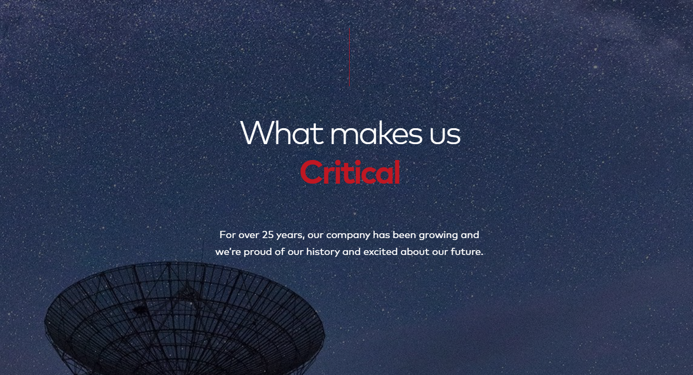

# Safety-Critical AI Manifesto 🚀

> ❗**Disclaimer:** initial versions of this manifesto were generated by an AI system with human supervision to ensure accuracy and relevance.

## Preamble

In the last decades, artificial intelligence (AI) has become a driving force in our society.

From virtual assistants like Alexa or Siri to the recommendation engines behind streaming platforms and e-commerce websites, AI is so ingrained into everyday life now that we only seem to notice its existence when it fails.

In critical domains, where the old *move fast / break things* philosophy is not an option, the reach of AI is also growing.

We now have systems out in the world that provide personalized diagnosis to patients, ensure collision-free navigation in self-driving cars, and enhance railway safety with automated signaling.

The problem is that the widespread use of AI, while bringing obvious opportunities for increasing efficiency, also introduces serious risks and challenges like job displacement and privacy concerns.

In our never-ending pursuit of knowledge and innovation, we must ensure that the net sum of these advancements in AI and machine learning (ML) leads to a positive outcome for humanity as a whole.

This manifesto outlines our commitment to developing, testing, and deploying AI systems across various high-stake domains that prioritize safety and reliability.

## Core Principles

### 🙋‍♀️ Human-First

* Our systems will place human rights, well-being, and safety above all else.

* We are committed to designing AI that aims to support and enhance human capabilities, not replace them.

### 🪟 Transparency and Accountability

* We will maintain transparency in our development processes, ensuring that all stakeholders, including developers, users, and regulators, understand how AI systems operate.

* Accountability mechanisms, such as regular audits and transparent reporting, will be established to address any unintended consequences of AI deployment.

### 🔩 Robustness and Reliability

* Our AI systems will be rigorously tested to ensure they perform reliably under diverse conditions.

* We will implement fail-safes and redundancies to mitigate AI failures.

### 🧩 Ethical Dilemmas

* Ethical considerations, emphasizing fairness, privacy, and accountability, will be incorporated throughout the entire development process, from initial planning to implementation.

* We will actively seek to avoid biases and ensure fairness in decision-making processes.

### 🔁 Continuous Improvement

* AI systems will be continuously monitored and updated to meet new challenges and advancements.

* We will foster a culture of learning and experimentation by implementing structured feedback mechanisms, such as surveys and focus groups, to gather and act on input from users, developers, regulators, and other stakeholders.

### 🤝 Diversity & Inclusion

* We will collaborate with industry partners, regulators, and the broader community to advance AI safety standards and promote best practices.

* We will prioritize inclusivity in our AI development, actively seeking and incorporating diverse viewpoints throughout the process.

### 🌱 Environmental Responsibility

* We are committed to creating environmentally responsible AI.

* We are committed to using AI in a way that promotes a healthier planet.

## Commitment to Action

We are committed to using these principles in every project in order to develop technology that benefits us while protecting our long-term well-being.

By adhering to this manifesto, we aim to *build a better and safer world* for everyone.

> ♞ *"We are not being replaced - we are being promoted!"* ― Garry Kasparov

