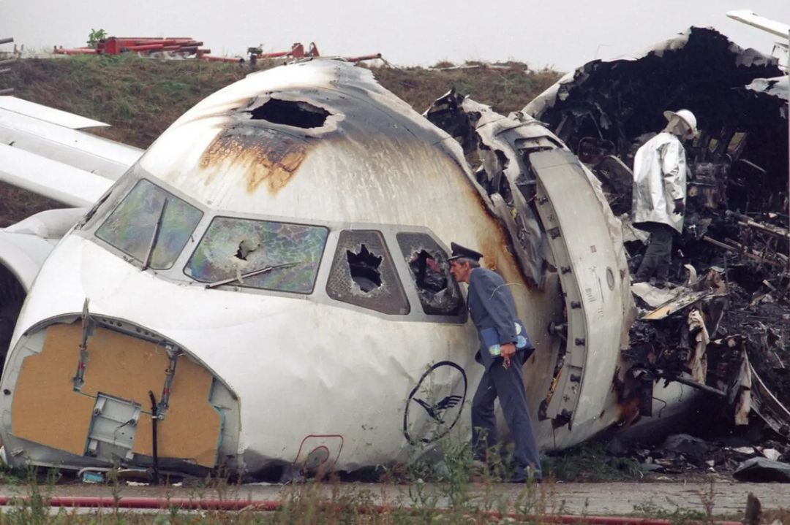
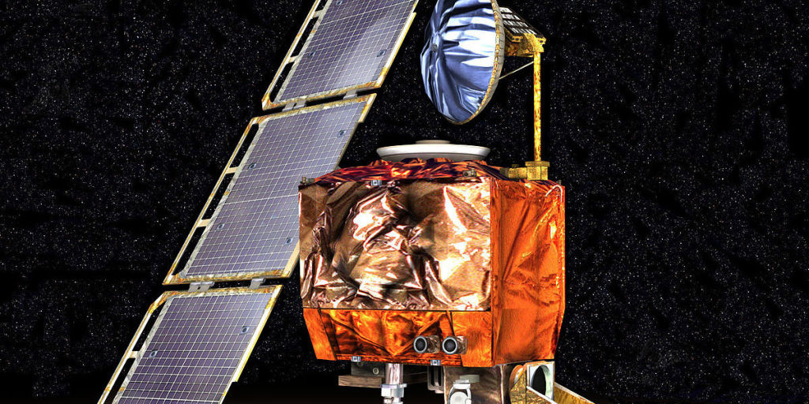
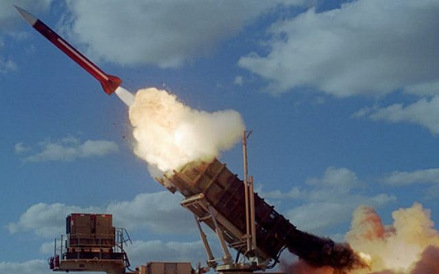
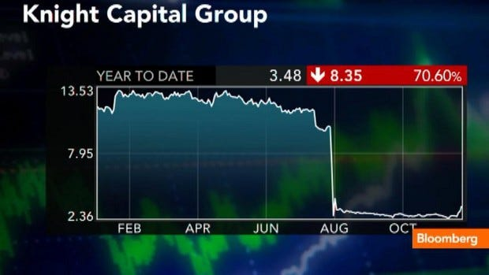
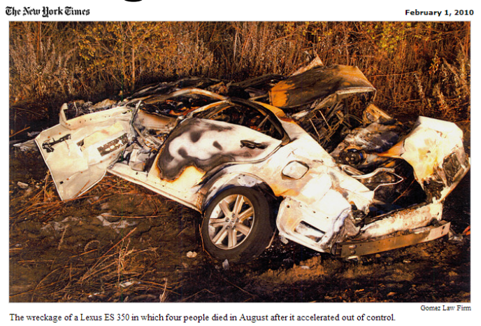
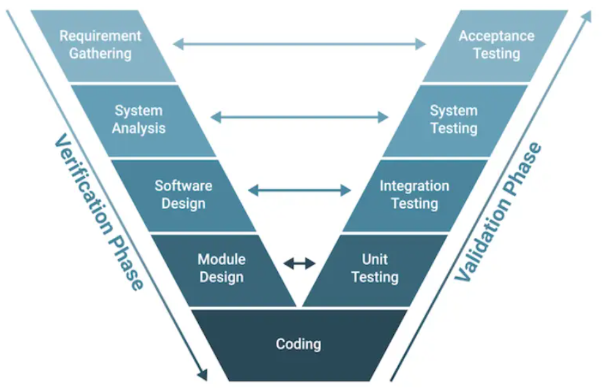

# Awesome Safety-Critical AI

[](https://awesome.re)     

**👋 Welcome to Awesome Safety-Critical AI** - a curated space for practitioners, researchers and engineers committed to building intelligent systems that are as *reliable* as they are *capable*.

Inspired by systems thinking and engineering rigour, this project focuses on how to move from clever prototypes to fault-tolerant, production-grade ML systems.

Whether you're working on autonomous vehicles, medical diagnosis, or airbone systems, this collection offers a blueprint for AI that can be trusted when it matters most.

AI in critical systems is not about polishing demos or chasing benchmarks. It's about anticipating chaos - and designing for it.

This isn't just another (awesome) list. It's a call to action!


## <a id="toc"></a>Table of Contents

* [🐇 Introduction](#introduction)
* [🌟 Editor's Choice](#top-picks)
* [🏃 TLDR](#tldr)
* [📝 Articles](#articles)
* [✍️ Blogs](#blogs)
* [📚 Books](#books)
* [📜 Certifications](#certifications)
* [🎤 Conferences](#conferences)
* [👩‍🏫 Courses](#courses)
* [📙 Guidelines](#guidelines)
* [🤝 Initiatives](#initiatives)
* [📋 Reports](#reports)
* [🛣️ Roadmaps](#roadmaps)
* [📐 Standards](#standards)
* [🛠️ Tools](#tools)
* [📺 Videos](#videos)
* [📄 Whitepapers](#whitepapers)
* [👷🏼 Working Groups](#working-groups)
* [👾 Miscellaneous](#miscellaneous)
* [🏁 Meta](#meta)
* [About Us](#about-us)
* [Contributions](#contributions)
* [Contributors](#contributors)
* [Citation](#citation)

## <a id="introduction"></a>🐇 Introduction

### What is a Critical System?

> Critical systems are built on trust - and trust is built on rock-solid engineering.

Critical systems are those whose failure can lead to injury 🤕, loss of life ☠️, environmental harm 🌱🚱, infrastructure damage 🏗️💥, or mission failure 🎯.

| **Application**                   | **Industry Vertical** | **Description**                       | **Failure Impact**                     |
| --------------------------------- | --------------------- | ------------------------------------- | ------------------------------------------- |
| **Patient Monitoring**            | Healthcare            | Tracks vital signs                    | Failure can delay life-saving interventions |
| **Aircraft Navigation**           | Aerospace / Aviation  | Ensures safe flight paths             | Errors can lead to accidents                |
| **Power Grid Control**            | Energy                | Manages electricity distribution      | Failures can cause blackouts                |
| **Command & Control**             | Defence               | Coordinates military actions          | Failure risks national security             |
| **Industrial Automation Control** | Manufacturing         | Oversees production processes         | Malfunction can cause damage or injury      |
| **Core Banking System**           | Finance               | Handles transactions and account data | Downtime can affect financial operations    |

These are systems that **must** operate with high levels of safety, reliability and availability, often under *unclear* and *unpredictable* conditions.

These are also the systems we tend to forget about... until something goes horribly wrong 🫣

     

| **Incident**                   | **Year**  | **Description**                                                                 | **Root Cause**                                                                 | **Industry Vertical**         | **References** |
|--------------------------------|-----------|----------------------------------------------------------------------------------|------------------------------------------------------------------------------------------|-------------------------------|----------------|
| **Therac-25 Radiation Overdose** | `1985–1987` | Radiation therapy machine gave fatal overdoses to multiple patients             | Race conditions and lack of safety interlocks; poor error handling                       | Healthcare                    | [Wikipedia](https://en.wikipedia.org/wiki/Therac-25), [Stanford](https://web.stanford.edu/class/cs208e/lectures/17-Computers-and-Ethics/Therac25.pdf) |
| **Lufthansa Flight 2904**       | `1993`      | Airbus A320 crashed during landing in Warsaw due to thrust reverser failure     | Reversers disabled by software logic when gear compression conditions weren’t met        | Aviation                      | [Wikipedia](https://en.wikipedia.org/wiki/Lufthansa_Flight_2904), [Simple Flying](https://simpleflying.com/lufthansa-flight-2904-runway-overrun-story/) |
| **Ariane Flight V88**           | `1996`      | Ariane 5 rocket self-destructed seconds after launch                            | Unhandled overflow converting 64-bit float to 16-bit integer                             | Aerospace                     | [Wikipedia](https://en.wikipedia.org/wiki/Ariane_flight_V88), [MIT](http://sunnyday.mit.edu/nasa-class/Ariane5-report.html) |
| **Mars Climate Orbiter**        | `1999`      | NASA probe lost due to trajectory miscalculation                                | Metric vs imperial unit mismatch between subsystems                                      | Space Exploration             | [NASA](https://sma.nasa.gov/docs/default-source/safety-messages/safetymessage-2009-08-01-themarsclimateorbitermishap.pdf) |
| **Patriot Missile Failure**     | `1991`      | Failed interception of Scud missile during Gulf War                             | Rounding error in floating-point time tracking caused significant drift                  | Defence                       | [Barr Group](https://barrgroup.com/sites/default/files/case-study-patriot-missile-defects.pdf), [GAO](https://apps.dtic.mil/sti/citations/ADA344865) |
| **Knight Capital Loss**         | `2012`      | Trading system triggered erratic market orders causing massive financial loss   | Deployment of obsolete test code; no safeguards for live operations                      | Finance / Trading             | [Henrico Dolfing](https://www.henricodolfing.com/2019/06/project-failure-case-study-knight-capital.html), [CNN](https://money.cnn.com/2012/08/09/technology/knight-expensive-computer-bug/index.html) |
| **Toyota Unintended Acceleration** | `2009–10` | Reports of unexpected vehicle acceleration and crashes                          | Stack overflow and memory corruption in embedded ECU software                            | Automotive                    | [SAE](https://www.sae.org/publications/technical-papers/content/2011-01-0995/), [Wikipedia](https://en.wikipedia.org/wiki/Toyota_vehicle_recalls) |
| **F-22 Raptor GPS Failure**     | `2007`      | Multiple jets lost navigation after crossing the International Date Line        | Software couldn't handle date transition; triggered reboot                               | Aerospace / Defence           | [FlightGlobal](https://www.flightglobal.com/pictures-navigational-software-glitch-forces-lockheed-martin-f-22-raptors-back-to-hawaii-abandoning-first-foreign-deployment-to-japan/72004.article), [Wikipedia](https://en.wikipedia.org/wiki/F-22_Raptor#Incidents) |
| **Heartbleed Bug**              | `2014`      | Security vulnerability in SSL exposed private server data                       | Improper bounds checking in the heartbeat extension of OpenSSL                           | Cybersecurity / IT            | [Heartbleed](https://heartbleed.com/), [CNET](https://www.cnet.com/news/privacy/heartbleed-bug-what-you-need-to-know-faq/) |
| **T-Mobile Sidekick Data Loss** | `2009`      | Users lost personal data during server migration                                | Software mishandling during data center transition led to irreversible loss              | Telecom / Cloud Services      | [TechCrunch](https://techcrunch.com/2009/10/13/sidekick-user-data-may-be-recovered-after-all/), [PCWorld](https://www.pcworld.com/article/520107/sidekick_data_loss_t_mobiles_unending_nightmare.html) |

When the stakes are this high, conventional software engineering practices needs to be supplemented with rigorous verification, validation and certification processes that are designed to ensure the system's integrity.



In critical systems, there are no shortcuts - engineering rigour is everything.

### AI in Critical Systems

> When failure costs lives, AI must be engineered like a scalpel, not a sledgehammer.

So, where does that leave us? **Is there room for AI in critical systems?**

Well, this isn't really a thought experiment as we're already far beyond the realm of hypotheticals.

From making life-or-death decisions in the ICU to controlling UAVs, doing surveillance and threat detection, and powering self-driving cars, intelligent systems are not just emerging in these areas, they are fully operational.

| **Use Case**                                 | **Brief Description**                                                                                   | **Industry Domain**              | **References** |
|----------------------------------------------|----------------------------------------------------------------------------------------------------------|----------------------------------|----------------|
| **Predicting ICU Length of Stay**            | AI models use patient data to forecast ICU duration, improving resource allocation and care planning.   | Healthcare                       | [INFORMS](https://www.informs.org/News-Room/INFORMS-Releases/News-Releases/New-Study-Reveals-AI-s-Transformative-Impact-on-ICU-Care-with-Smarter-Predictions-and-Transparent-Insights), [Springer](https://link.springer.com/article/10.1007/s00134-023-07102-y) |
| **AI in Radiation Therapy Planning**         | Optimizes dose targeting using historical patient models, improving treatment precision and safety.      | Healthcare                       | [Siemens](www.siemens-healthineers.com/perspectives/AI-cancer-care) [Healthineers](https://www.siemens-healthineers.com/insights/artificial-intelligence-in-radiation-oncology) |
| **Self-Driving Cars**                        | Powers perception, decision-making, and control systems for autonomous vehicles.                        | Transportation                   | [Built In](https://builtin.com/artificial-intelligence/artificial-intelligence-automotive-industry), [Rapid Innovation](https://www.rapidinnovation.io/post/ai-in-self-driving-cars) |
| **Autonomous Drone Navigation**              | Enables drones to navigate complex terrain without GPS; supports rescue and defense operations.         | Aerospace / Defense              | [MDPI](https://www.mdpi.com/2504-446X/8/7/296), [Fly Eye](https://www.flyeye.io/how-ai-is-used-in-drones/) |
| **AI-Based Conflict Detection in ATC**       | Forecasts aircraft trajectories to alert controllers of potential collision risks.                       | Aerospace / Defense              | [Raven Aero](https://raven.aero/news/ai-meets-aviation-smarter-air-traffic-control/), [AviationFile](https://www.aviationfile.com/artificial-intelligence-and-air-traffic-control/) |
| **Remote Digital Towers for Airports**       | AI interprets visual data to assist air traffic controllers in low-visibility conditions.                | Aerospace / Defense              | [Airways Magazine](https://www.airwaysmag.com/legacy-posts/artificial-intelligence-air-traffic-control) |
| **Predictive Maintenance in Nuclear Reactors**| Analyzes reactor sensor data to detect early failures, preventing major accidents.                       | Energy                           | [Accelerant](https://discoveraccelerant.com/ai-in-nuclear-plants/), [IAEA](https://www.iaea.org/bulletin/enhancing-nuclear-power-production-with-artificial-intelligence) |
| **AI-Assisted Reactor Control Systems**      | Supports operators by modeling physical processes and recommending safety actions in real time.         | Energy                           | [Uatom.org](https://www.uatom.org/en/2024/08/27/the-role-and-prospects-of-ai-in-strengthening-the-safety-of-nuclear-facilities.html), [Springer](https://link.springer.com/chapter/10.1007/978-3-030-96592-1_9) |
| **Autonomous Navigation for Cargo Ships**    | Enables real-time path planning to avoid obstacles and optimize maritime routes.                         | Transportation                   | [MaritimeEd](https://maritimeducation.com/ai-in-autonomous-vessels-the-future-of-crewless-ships-smart-navigation-and-collision-prevention/), [ShipFinex](https://www.shipfinex.com/blog/autonomous-ships-in-the-maritime-industry) |
| **AI-Based Collision Avoidance at Sea**      | Detects and responds to high-risk vessel situations using visual and radar data fusion.                  | Transportation                   | [Ship Universe](https://www.shipuniverse.com/news/ai-transformations-in-maritime-shipping-navigating-2025/) |
| **AI-Driven Fraud Detection**                | Identifies anomalous financial transactions and flags potential fraud in real time.                      | Financial Systems                | [Upskillist](https://www.upskillist.com/blog/ai-agents-in-finance-applications-examples-and-usecases/), [Xenoss](https://xenoss.io/blog/real-time-ai-fraud-detection-in-banking) |
| **AI for Compliance Monitoring**             | Uses NLP to parse documents and logs for regulatory breaches, supporting audits and governance.          | Financial Systems                | [Digital Adoption](https://www.digital-adoption.com/ai-in-finance-examples/), [LeewayHertz](https://www.leewayhertz.com/ai-in-fraud-detection/) |
| **AI in Wildfire Early Detection**           | Processes satellite and sensor data to detect hotspots and alert emergency services.                     | Environmental Safety             | [NASA FireSense](https://cce.nasa.gov/firesense/), [PreventionWeb](https://www.preventionweb.net/news/nasa-wildfire-digital-twin-pioneers-new-ai-models-and-streaming-data-techniques-forecasting) |

Building these systems is no walk in the park. ML brings powerful capabilities, but also adds layers of complexity and risk that need to be addressed through careful engineering.

While its ability to learn patterns and make data-driven decisions is unmatched in some domains, the adoption of AI in high-stakes environments must be tempered with caution, transparency, and a sharp understanding of its limitations.

Let's briefly recap some of the most important...

#### Models can and will make mistakes


Better models may make fewer mistakes, but mistakes are generally *unavoidable*.

Model misfires are not a sign of poor engineering, but an intrinsic feature of intelligence.

Unlike traditional software, which follows explicit rules, AI learns from data and generalises. Generalization is powerful, but also imperfect.

Working with AI means accepting that uncertainty and designing systems that can handle it gracefully.

#### Models often makes mistakes that seem strange and unpredictable


AI doesn't always fail in ways that make sense to us.

It might [misclassify a stop sign with a sticker as a speed limit sign](https://spectrum.ieee.org/slight-street-sign-modifications-can-fool-machine-learning-algorithms) or [switch treatment recommendations based on the user's language](https://www.newscientist.com/article/2486372-typos-and-slang-spur-ai-to-discourage-seeking-medical-care/).

<!--img src="assets/images/stop_signs.jpg" height="100px"/-->

Again, these aren't bugs in the traditional sense. These are artefacts of how the model interprets patterns.

Unlike human experts, who tend to make errors that are consistent with a rational view of the world, AI can go completely off the rails (pun intended).

It might suggest a giraffe is a toaster, or that a benign tumour is malignant.

These failures can be baffling, and they demand robust monitoring and fallback strategies.

If not properly mitigated, they can render a system *useless*, or worse, **dangerous**.

#### Models aren't always deterministic


Traditional software is designed to behave the same way every time. Same input, same output, *ceteris paribus*.

By contrast, AI systems can improve or degrade based on new data, which means that today's behaviour might **not** match tomorrow's.

Notice the use of **might** instead of **will**. Just because models **can** be random or probabilistic doesn't mean they **have** to be.

While ML training can be **nondeterministic**, the resulting models are often **deterministic** during inference. Given the same input, these models will consistently produce the same outputs... and make the same mistakes.

#### Time changes everything


According to platonic lore, the pre-socratic philosopher Heraclitus was one of the first to propose the idea that change is the only constant in the Universe (Πάντα ῥεῖ).

In the world of AI and ML, the effects of the passage of time are especially dire:

- **Concept drift:** the way inputs map to the correct outputs changes
- **Data drift:** the kind of data the model sees starts to look different
- **Label drift:** labels change in meaning and/or frequency
- **Covariate drift:** input values change in unexpected ways
- **Prior probability drift:** some outcomes become more or less common than before
- **Feature relevance drift:** things that once mattered to the model may no longer be useful

Drift doesn't usually crash a model, it just makes it *quietly wrong*.

In AI, silence isn't golden - it's a warning sign ⚠️

#### Changes can be disruptive


A model update might boost accuracy overall but introduce new blind spots.

A retrained model might actually perform worse in certain edge cases.

Change must be managed and monitored carefully, with rigorous testing and rollback plans.

#### Perfection is a mirage


Achieving zero-error performance in AI is very expensive and, in many cases, **impossible**.

Instead, the goal should be to reduce risk to acceptable levels and build systems that can tolerate incorrect answers.

#### Always have a safety net


When AI fails - and it will - the overall system must be able to recover.

This could be a human-in-the-loop, a rule-based override, or a safe fallback mode.

When it comes to critical systems, recovery is **never** an option.

## <a id="top-picks"></a>🌟 Editor's Choice

<small>[🔼 Back to top](#toc)</small>

* If you're just starting, here's our recommended reading list:
  - [ML in Production](https://mlip-cmu.github.io/book/) by Christian Kästner // Chapters 2 (From Models to Systems) and 7 (Planning for Mistakes)
  - [Building Intelligent Systems](https://www.amazon.com/Building-Intelligent-Systems-Learning-Engineering/dp/1484234316) by Geoff Hulten // Chapters 6 (Why Creating Intelligent Experiences is Hard), 7 (Balancing Intelligent Experiences) and 24 (Dealing with Mistakes)
* 🧰 An awesome set of [tools for production-ready ML](https://github.com/EthicalML/awesome-production-machine-learning)
    > **A word of caution** ☝️ Use them wisely and remember that *"a sword is only as good as the man [or woman] who wields it"*
* 😈 A collection of scary [use cases](https://github.com/daviddao/awful-ai), [incidents](https://incidentdatabase.ai/) and [failures](https://avidml.org/) of AI, which will hopefully raise awareness to its misuses
* 💳 The now-classic [high-interest credit card of technical debt](https://static.googleusercontent.com/media/research.google.com/en//pubs/archive/43146.pdf) paper by Google
* 🤝 An introduction to [trustworthy AI](https://www.semanticscholar.org/paper/Trustworthy-AI-Part-1-Mariani-Rossi/2e550e23511711dae2689322741f9c113c6c506f) by NVIDIA
* 🚩 Lessons-learned from [red teaming hundreds of generative AI products](https://arxiv.org/abs/2501.07238) by Microsoft
* 🚨 Last but not least, the top 10 [risks for LLM applications and Generative AI](https://genai.owasp.org/) by OWASP

## <a id="tldr"></a>🏃 TLDR

<small>[🔼 Back to top](#toc)</small>

If you're in a hurry or just don't like reading, here's a podcast-style breakdown created with [NotebookLM](https://notebooklm.google/) (courtesy of [Pedro Nunes](https://github.com/pedrosaunu) 🙏)

[](https://soundcloud.com/safety-critical-podcasts/safety-critical-ai-101-podcast)

## <a id="articles"></a>📝 Articles

<small>[🔼 Back to top](#toc)</small>

* (Adedjouma *et al.*, 2024) [Engineering Dependable AI Systems](https://hal.science/hal-03700300v1)
* (Bach *et al.*, 2024) [Unpacking Human-AI Interaction in Safety-Critical Industries: A Systematic Literature Review](https://ieeexplore.ieee.org/document/10620168)
* (Barman *et al.*, 2024) [The Brittleness of AI-Generated Image Watermarking Techniques: Examining Their Robustness Against Visual Paraphrasing Attacks](https://arxiv.org/abs/2408.10446)
* (Becker *et al.*, 2021) [AI at work – Mitigating safety and discriminatory risk with technical standards](https://www.interface-eu.org/publications/ai-work-mitigating-safety-and-discriminatory-risk-technical-standards)
* (Belani, Vukovic & Car, 2019) [Requirements Engineering Challenges in Building AI-Based Complex Systems](https://arxiv.org/abs/1908.11791)
* (Beyers *et al.*, 2019) [Quantification of the Impact of Random Hardware Faults on Safety-Critical AI Applications: CNN-Based Traffic Sign Recognition Case Study](https://ieeexplore.ieee.org/document/8990333)
* (Bloomfield *et al.*, 2021) [Safety Case Templates for Autonomous Systems](https://arxiv.org/abs/2102.02625)
* (Bolchini, Cassano & Miele, 2024) [Resilience of Deep Learning applications: a systematic literature review of analysis and hardening techniques](https://arxiv.org/abs/2309.16733)
* (Bondar, 2025) [Ukraine's Future Vision and Current Capabilities for Waging AI-Enabled Autonomous Warfare](https://www.csis.org/analysis/ukraines-future-vision-and-current-capabilities-waging-ai-enabled-autonomous-warfare)
* (Bloomfield & Rushby, 2025) [Where AI Assurance Might Go Wrong: Initial lessons from engineering of critical systems](https://arxiv.org/abs/2502.03467)
* (Breck *et al.*, 2016) [What’s your ML test score? A rubric for ML production systems](https://research.google/pubs/whats-your-ml-test-score-a-rubric-for-ml-production-systems/)
* (Bullwinkel *et al.*, 2025) [Lessons From Red Teaming 100 Generative AI Products](https://arxiv.org/abs/2501.07238)
* (Burton & Herd, 2023) [Addressing uncertainty in the safety assurance of machine-learning](https://www.frontiersin.org/journals/computer-science/articles/10.3389/fcomp.2023.1132580/full)
* (Cummings, 2021) [Rethinking the Maturity of Artificial Intelligence in Safety-Critical Settings](https://ojs.aaai.org/aimagazine/index.php/aimagazine/article/view/7394)
* (Dalrymple *et al.*, 2025) [Towards Guaranteed Safe AI: A Framework for Ensuring Robust and Reliable AI Systems](https://arxiv.org/abs/2405.06624)
* (Delseny *et al.*, 2021) [White Paper Machine Learning in Certified Systems](https://arxiv.org/abs/2103.10529)
* (Dutta *et al.*, 2017) [Output range analysis for deep feedforward neural networks](https://arxiv.org/abs/1709.09130)
* (Endres *et al.*, 2023) [Can Large Language Models Transform Natural Language Intent into Formal Method Postconditions?](https://nl2postcond.github.io/)
* (Farahmand & Neu, 2025) [AI Safety for Physical Infrastructures: A Collaborative and Interdisciplinary Approach](https://onlinelibrary.wiley.com/doi/full/10.1111/ffe.14575)
* (Faria, 2018) [Machine learning safety: An overview](https://scsc.uk/e503prog)
* (Feather & Pinto, 2023) [Assurance for Autonomy – JPL’s past research, lessons learned, and future directions](https://arxiv.org/abs/2305.11902)
* (Gebru *et al.*, 2018) [Datasheets for Datasets](https://arxiv.org/abs/1803.09010)
* (Gursel *et al.*, 2025) [The role of AI in detecting and mitigating human errors in safety-critical industries: A review](https://www.sciencedirect.com/science/article/abs/pii/S0951832024007531)
* (Habli, Lawton & Porter, 2020) [Artificial intelligence in health care: accountability and safety](https://pmc.ncbi.nlm.nih.gov/articles/PMC7133468/)
* (Hasani *et al.*, 2022) [Trustworthy Artificial Intelligence in Medical Imaging](https://pmc.ncbi.nlm.nih.gov/articles/PMC8785402/)
* (Hennigen *et al.*, 2023) [Towards Verifiable Text Generation with Symbolic References]()
* (Houben *et al.*, 2022) [Inspect, Understand, Overcome: A Survey of Practical Methods for AI Safety](https://link.springer.com/chapter/10.1007/978-3-031-01233-4_1)
* (Jackson, 1995) [The world and the machine](https://dl.acm.org/doi/10.1145/225014.225041)
* (Jamakatel *et al.*, 2024) [A Goal-Directed Dialogue System for Assistance in Safety-Critical Application](https://www.ijcai.org/proceedings/2024/870)
* (Johnson, 2018) [The Increasing Risks of Risk Assessment: On the Rise of Artificial Intelligence and Non-Determinism in Safety-Critical Systems](https://www.dcs.gla.ac.uk/~johnson/papers/SCSC_18.pdf)
* (Khattak *et al.*, 2024) [AI-supported estimation of safety critical wind shear-induced aircraft go-around events utilizing pilot reports](https://www.cell.com/heliyon/fulltext/S2405-8440(24)04600-0)
* (Kiseleva *et al.*, 2025) [The EU AI Act, Stakeholder Needs, and Explainable AI: Aligning Regulatory Compliance in a Clinical Decision Support System](https://arxiv.org/pdf/2505.20311)
* (Kuwajima, Yasuoka & Nakae, 2020) [Engineering problems in machine learning systems](https://link.springer.com/article/10.1007/s10994-020-05872-w)
* (Leofante *et al.*, 2018) [Automated Verification of Neural Networks: Advances, Challenges and Perspectives](https://arxiv.org/abs/1805.09938)
* (Li *et al.*, 2022) [Trustworthy AI: From Principles to Practices](https://arxiv.org/abs/2110.01167)
* (Li *et al.*, 2024) [Formal-LLM: Integrating Formal Language and Natural Language for Controllable LLM-based Agents](https://arxiv.org/abs/2402.00798)
* (Lones, 2021) [How to avoid machine learning pitfalls: a guide for academic researchers
](https://arxiv.org/abs/2108.02497)
* (Lubana, 2024) [Understanding and Identifying Challenges in Design of Safety-Critical AI Systems](https://deepblue.lib.umich.edu/handle/2027.42/196092)
* (Luckcuck *et al.*, 2019) [Formal Specification and Verification of Autonomous Robotic Systems: A Survey](https://arxiv.org/abs/1807.00048)
* (Lwakatare *et al.*, 2020) [Large-scale machine learning systems in real-world industrial settings: A review of challenges and solutions](https://www.sciencedirect.com/science/article/abs/pii/S0950584920301373)
* (Macher *et al.*, 2021) [Architectural Patterns for Integrating AI Technology into Safety-Critical System](https://dl.acm.org/doi/fullHtml/10.1145/3489449.3490014)
* (Mariani *et al.*, 2023) [Trustworthy AI - Part I](https://www.semanticscholar.org/paper/Trustworthy-AI-Part-1-Mariani-Rossi/2e550e23511711dae2689322741f9c113c6c506f), [II](https://www.semanticscholar.org/paper/Trustworthy-AI-Part-II-Mariani-Rossi/9f354b3a88e6d6512d22ec152e6c6131a1e44cab) and [III](https://www.semanticscholar.org/paper/Trustworthy-AI-Part-III-Mariani-Rossi/ff446b46c5b9b4c0d18849d479fe5645f6182a36)
* (Meyers, Löfstedt & Elmroth, 2023) [Safety-critical computer vision: an empirical survey of adversarial evasion attacks and defenses on computer vision systems](https://link.springer.com/article/10.1007/s10462-023-10521-4)
* (Mitchell *et al.*, 2019) [Model cards for model reporting](https://arxiv.org/abs/1810.03993)
* (Papernot *et al.*, 2018) [SoK: Security and Privacy in Machine Learning](https://ieeexplore.ieee.org/document/8406613)
* (Passi & Sengers, 2020) [Making data science systems work](https://journals.sagepub.com/doi/10.1177/2053951720939605)
* (Patel *et al.*, 2025) [Towards Secure MLOps: Surveying Attacks, Mitigation Strategies, and Research Challenges](https://arxiv.org/abs/2506.02032v1)
* (Pereira & Thomas, 2024) [Challenges of Machine Learning Applied to Safety-Critical Cyber-Physical Systems](https://www.mdpi.com/2504-4990/2/4/31)
* (Perez-Cerrolaza *et al.*, 2024) [Artificial Intelligence for Safety-Critical Systems in Industrial and Transportation Domains: A Survey](https://dl.acm.org/doi/10.1145/3626314)
* (Phelps & Ranson, 2023) [Of Models and Tin Men: A Behavioural Economics Study of Principal-Agent Problems in AI Alignment using Large-Language Models](https://arxiv.org/abs/2307.11137)
* (Picardi *et al.*, 2020) [Assurance Argument Patterns and Processes for Machine Learning in Safety-Related Systems](https://ceur-ws.org/Vol-2560/paper17.pdf)
* (Pushkarna, Zaldivar & Kjartansson, 2022) [Data Cards: Purposeful and Transparent Dataset Documentation for Responsible AI](https://arxiv.org/abs/2204.01075)
* (Rajagede *et al.*, 2025) [NAPER: Fault Protection for Real-Time Resource-Constrained Deep Neural Networks](https://arxiv.org/abs/2504.06591)
* (Ramos *et al.*, 2024) [Collaborative Intelligence for Safety-Critical Industries: A Literature Review](https://www.mdpi.com/2078-2489/15/11/728)
* (Schulhoff *et al.*, 2025) [Ignore This Title and HackAPrompt: Exposing Systemic Vulnerabilities of LLMs through a Global Scale Prompt Hacking Competition](https://arxiv.org/abs/2311.16119)
* (Schulhoff *et al.*, 2024) [The Prompt Report: A Systematic Survey of Prompt Engineering Techniques](https://arxiv.org/abs/2406.06608)
* (Sculley *et al.*, 2015) [Hidden Technical Debt in Machine Learning Systems](https://proceedings.neurips.cc/paper/2015/file/86df7dcfd896fcaf2674f757a2463eba-Paper.pdf)
* (Seshia, Sadigh & Sastry, 2020) [Towards Verified Artificial Intelligence](https://arxiv.org/abs/1606.08514)
* (Sinha *et al.*, 2020) [Neural Bridge Sampling for Evaluating Safety-Critical Autonomous Systems](https://arxiv.org/abs/2008.10581)
* (Sousa, Moutinho & Almeida, 2020) [Expert-in-the-loop Systems Towards Safety-critical Machine Learning Technology in Wildfire Intelligence](https://www.climatechange.ai/papers/neurips2020/90)
* (Tambon *et al.*, 2021) [How to Certify Machine Learning Based Safety-critical Systems? A Systematic Literature Review](https://arxiv.org/abs/2107.12045)
* (Urban & Miné, 2021) [A Review of Formal Methods applied to Machine Learning](https://arxiv.org/abs/2104.02466)
* (Uuk *et al.*, 2025) [Effective Mitigations for Systemic Risks from General-Purpose AI](https://papers.ssrn.com/sol3/papers.cfm?abstract_id=5021463)
* (Wagstaff, 2012) [Machine Learning that Matters](https://arxiv.org/abs/1206.4656)
* (Wang & Chung, 2021) [Artificial intelligence in safety-critical systems: a systematic review](https://www.semanticscholar.org/paper/Artificial-intelligence-in-safety-critical-systems%3A-Wang-Chung/dd56d26b7efd78651f9abf530741da8de7ca1a69)
* (Webster *et al.*, 2019) [A corroborative approach to verification and validation of human-robot teams](https://arxiv.org/pdf/1608.07403)
* (Weiding *et al.*. 2024) [Holistic Safety and Responsibility Evaluations of Advanced AI Models](https://arxiv.org/abs/2404.14068v1)
* (Wen & Machida, 2025) [Reliability modeling for three-version machine learning systems through Bayesian networks](https://www.sciencedirect.com/science/article/pii/S0951832025002170)
* (Williams & Yampolskiy, 2021) [Understanding and Avoiding AI Failures: A Practical Guide](https://arxiv.org/abs/2104.12582v4)
* (Woodburn, 2021) [Machine Learning and Software Product Assurance: Bridging the Gap](https://ecss.nl/wp-content/uploads/2017/02/ESA-TECQQS-TN-022868_1_1.pdf)
* (Xie *et al.*, 2020) [DeepHunter: a coverage-guided fuzz testing framework for deep neural networks](https://dl.acm.org/doi/10.1145/3293882.3330579)
* (Yu *et al.*, 2024) [A Survey on Failure Analysis and Fault Injection in AI Systems](https://arxiv.org/abs/2407.00125)
* (Zhang & Li, 2020) [Testing and verification of neural-network-based safety-critical control software: A systematic literature review](https://www.sciencedirect.com/science/article/pii/S0950584920300471)
* (Zhang *et al.*, 2020) [Machine Learning Testing: Survey, Landscapes and Horizons](https://ieeexplore.ieee.org/document/9000651)
* (Zhang *et al.*, 2024) [The Fusion of Large Language Models and Formal Methods for Trustworthy AI Agents: A Roadmap](https://arxiv.org/abs/2412.06512)


## <a id="blogs"></a>✍️ Blogs

<small>[🔼 Back to top](#toc)</small>

* (Bits & Atoms, 2017) [Designing Effective Policies for Safety-Critical AI](https://bitsandatoms.co/effective-policies-for-safety-critical-ai/)
* (Bits & Chips, 2024) [Verifying and validating AI in safety-critical systems](https://bits-chips.com/article/verifying-and-validating-ai-in-safety-critical-systems/)
* (Clear Prop, 2023) [Unpacking Human-AI Interaction in Safety-Critical Industries: A Systematic Literature Review](https://pamirsevincel.substack.com/p/clear-prop-9-forum-79-paper-spotlight)
* (CleverHans Lab, 2016) [Breaking things is easy](https://cleverhans.io/security/privacy/ml/2016/12/16/breaking-things-is-easy.html)
* (DeepMind, 2018) [Building safe artificial intelligence: specification, robustness, and assurance](https://deepmindsafetyresearch.medium.com/building-safe-artificial-intelligence-52f5f75058f1)
* (Doing AI Governance, 2025) [AI Governance Mega-map: Safe, Responsible AI and System, Data & Model Lifecycle](https://www.ethos-ai.org/p/ai-governance-mega-map-lifecycle)
* (EETimes, 2023) [Can We Trust AI in Safety Critical Systems?](https://www.eetimes.com/can-we-trust-ai-in-safety-critical-systems/)
* (Embedded, 2024) [The impact of AI/ML on qualifying safety-critical software](https://www.embedded.com/the-impact-of-ai-ml-on-qualifying-safety-critical-software/)
* (Forbes, 2022) [Part 2: Reflections On AI (Historical Safety Critical Systems)](https://www.forbes.com/sites/rahulrazdan/2022/03/13/reflections-on-a-decade-of-ai-part-2/)
* (Ground Truths, 2025) [When Doctors With AI Are Outperformed by AI Alone](https://www.nytimes.com/2025/02/02/opinion/ai-doctors-medicine.html?unlocked_article_code=1.t04.AeZg.kT0qka6kerAi&smid=url-share)
* (Homeland Security, 2022) [Artificial Intelligence, Critical Systems, and the Control Problem](https://www.hstoday.us/featured/artificial-intelligence-critical-systems-and-the-control-problem/)
* (Lakera, 2025) [AI Red Teaming: Securing Unpredictable Systems](https://www.lakera.ai/blog/ai-red-teaming)
* (Learn Prompting, 2025) [What is AI Red Teaming?](https://learnprompting.org/blog/what-is-ai-red-teaming)
* (Lynx, 2023) [How is AI being used in Aviation?](https://www.lynx.com/executive-blog/artificial-intelligence-in-avionics)
* (MathWorks, 2023) [The Road to AI Certification: The importance of Verification and Validation in AI](https://blogs.mathworks.com/deep-learning/2023/07/11/the-road-to-ai-certification-the-importance-of-verification-and-validation-in-ai)
* (Protect AI, 2025) [The Expanding Role of Red Teaming in Defending AI Systems](https://protectai.com/blog/expanding-role-red-teaming-defending-ai-systems)
* (restack, 2025) [Safety In Critical AI Systems](https://www.restack.io/p/ai-application-safety-protocols-answer-safety-in-critical-ai-systems-cat-ai)
* (Safety4Sea, 2024) [The risks and benefits of AI translations in safety-critical industries](https://safety4sea.com/the-risks-and-benefits-of-ai-translations-in-safety-critical-industries/)
* (Space and Time, 2024) [Verifiable LLMs for the Modern Enterprise](https://www.spaceandtime.io/blog/verifiable-llms-for-the-modern-enterprise)
* (think AI, 2024) [Artificial Intelligence in Safety-Critical Systems](https://medium.com/think-ai/ai-in-safety-critical-systems-6b778f26c965)
* (Wiz, 2025) [What is AI Red Teaming?](https://www.wiz.io/academy/ai-red-teaming)

## <a id="books"></a>📚 Books

<small>[🔼 Back to top](#toc)</small>

* (Chen *et al.*, 2022) [Reliable Machine Learning: Applying SRE Principles to ML in Production](https://www.amazon.com/Reliable-Machine-Learning-Principles-Production/dp/1098106229)
* (Hall, Curtis & Pandey, 2023) [Machine Learning for High-Risk Applications: Approaches to Responsible AI](https://www.oreilly.com/library/view/machine-learning-for/9781098102425/)
* (Huang, Jin & Ruan, 2023) [Machine Learning Safety](https://link.springer.com/book/10.1007/978-981-19-6814-3)
* (Hulten, 2018) [Building Intelligent Systems: A Guide to Machine Learning Engineering](https://www.amazon.com/Building-Intelligent-Systems-Learning-Engineering/dp/1484234316)
* (Huyen, 2022) [Designing Machine Learning Systems: An Iterative Process for Production-Ready Applications](https://www.amazon.com/Designing-Machine-Learning-Systems-Production-Ready/dp/1098107969?&_encoding=UTF8&tag=chiphuyen-20&linkCode=ur2&linkId=0a1dbab0e76f5996e29e1a97d45f14a5&camp=1789&creative=9325)
* (Jackson, Thomas & Millett, 2007) [Software for Dependable Systems: Sufficient Evidence?](https://nap.nationalacademies.org/catalog/11923/software-for-dependable-systems-sufficient-evidence)
* (Joseph *et al.*, 2019) [Adversarial Machine Learning](https://www.amazon.com/Adversarial-Machine-Learning-Anthony-Joseph/dp/1107043468)
* (Kastner, 2025) [Machine Learning in Production: From Models to Products](https://amazon.com/Machine-Learning-Production-Models-Products/dp/0262049724)
* (Levenson, 1995) [Safeware: System Safety and Computers](https://dl.acm.org/doi/book/10.1145/202709)
* (Molnar, 2025) [Interpretable Machine Learning: A Guide for Making Black Box Models Explainable](https://christophm.github.io/interpretable-ml-book/)
* (Pelillo & Scantamburlo, 2021) [Machines We Trust: Perspectives on Dependable AI](https://www.amazon.com/Machines-We-Trust-Perspectives-Dependable-ebook/dp/B08P46HDYG)
* (Tran, 2024) [Artificial Intelligence for Safety and Reliability Engineering: Methods, Applications, and Challenges](https://link.springer.com/book/10.1007/978-3-031-71495-5)
* (Varshney, 2021) [Trust in Machine Learning](https://www.manning.com/books/trust-in-machine-learning-cx)

## <a id="certifications"></a>📜 Certifications

<small>[🔼 Back to top](#toc)</small>

* (ISTQB) [Certified Tester AI Testing (CT-AI)](https://www.istqb.org/certifications/certified-tester-ai-testing-ct-ai/)
* (USAII) [Certified AI Scientist (CAIS)](https://www.usaii.org/artificial-intelligence-certifications/certified-artificial-intelligence-scientist)

## <a id="conferences"></a>🎤 Conferences

<small>[🔼 Back to top](#toc)</small>

* (EDCC2025) [20th European Dependable Computing Conference](https://edcc2025.campus.ciencias.ulisboa.pt/index.html)
* (ELLIS) [Robust ML Workshop 2024](https://sites.google.com/view/robustml2024/home)
* (HAI) [Workshop on Sociotechnical AI Safety](https://hai.stanford.edu/november-17-agenda-workshop-sociotechnical-ai-safety)
* (IJCAI-24) [AI for Critical Infrastructure](https://sites.google.com/view/aiforci-ijcai24/home)
* (KDD2023) [Trustworthy machine learning](https://mltrust.github.io/)
* (MITRE) [FAA Artificial Intelligence Safety Assurance: Roadmap and Technical Exchange Meetings](https://na.eventscloud.com/ereg/inactive.php?eventid=768017)
  * [AI/ML Components in Safety-Critical Aviation Systems: Selected Concepts and Underlying Principles](https://ntrs.nasa.gov/citations/20240009355)
  * [Developing Standards for AI/ML Systems in Civil Aviation: Challenges and Barriers](https://ntrs.nasa.gov/citations/20240000822)
* (NFM-AI-Safety-20) [NFM Workshop on AI Safety](https://sites.google.com/stanford.edu/nfm-ai-safety-20/)
* (MLOps Community) [AI in Production 2024](https://home.mlops.community/public/collections/ai-in-production-2024-02-18)
* (MLOps Community) [LLMs in Production 2023](https://home.mlops.community/public/collections/llms-in-production-conference-part-iii-2023)
* (Robust Intelligence) [ML:Integrity 2022](https://www.mlintegrityconference.com/)
* (SCSC 2025) [Safety Critical Systems Symposium SSS'25](https://www.thescsc.org/e1099)
* (SGAC 2023) [South Wales Safety Groups Alliance Conference and Exhibition](https://swwsafetygroup.co.uk/event/south-and-west-wales-safety-groups-alliance-conference-and-exhibition-always-think-risk/)
* (SSS'24) [32nd annual Safety-Critical Systems Symposium](https://scsc.uk/e1007)

## <a id="courses"></a>👩‍🏫 Courses

<small>[🔼 Back to top](#toc)</small>

* [AI for Good Specialization](https://www.deeplearning.ai/courses/ai-for-good/) @ DeepLearning.AI
* [AI for Social Good](https://web.stanford.edu/class/cs21si/) @ Stanford
* [AI Red Teaming](https://learn.microsoft.com/en-us/security/ai-red-team/) @ Microsoft
* [Dependable AI Systems](https://courses.grainger.illinois.edu/ece598rki/fa2023/) @ University of Illinois Urbana-Champaign
* [Introduction to AI Safety](https://web.stanford.edu/class/cs120/index.html) @ Stanford
* [Limits to Prediction](https://msalganik.github.io/soc555-cos598J_s2024/) @ Princeton University
* [Machine Learning for Healthcare](https://mlhcmit.github.io/) @ MIT
* [Machine Learning in Production](https://mlip-cmu.github.io/) @ Carnegie-Mellon University
* [Machine Learning Security](https://secure-ai.systems/courses/MLSec/W22/index.html) @ Oregon State University
* [Real-Time Mission-Critical Systems Design](https://www.coursera.org/learn/real-time-mission-critical-systems-design) @ University of Colorado Boulder / Coursera
* [Responsible AI](https://github.com/aws-samples/aws-machine-learning-university-responsible-ai) @ Amazon MLU
* [Robustness in Machine Learning](https://jerryzli.github.io/robust-ml-fall19.html) @ University of Washington
* [Safety Critical Systems](https://safetysystems.theiet.org/) @ IET
* [Safety Critical Systems](https://www.cs.ox.ac.uk/softeng/subjects/SCS.html) @ Oxford University
* [Security and Privacy of Machine Learning](https://secml.github.io/) @ University of Virginia
* [Trustworthy Artificial Intelligence](https://trustworthy-ml-course.github.io/) @ University of Michigan, Dearborn
* [Trustworthy Machine Learning](https://secure-ai.systems/courses/MLSec/W22/index.html) @ Oregon State University
* [Trustworthy Machine Learning](https://scalabletrustworthyai.github.io) @ University of Tübingen

## <a id="guidelines"></a>📙 Guidelines

<small>[🔼 Back to top](#toc)</small>

* (APT Research) [Artificial Intelligence/Machine Learning System Safety](https://www.apt-research.com/capabilities/artificial-intelligence-machine-learning-system-safety/)
* (CAIDP) [Universal Guidelines for AI](https://www.caidp.org/universal-guidelines-for-ai/)
* (DIU) [Reponsible AI Guidelines](https://www.diu.mil/responsible-ai-guidelines)
* (ESA) [ECSS-E-HB-40-02A – Machine learning handbook](https://ecss.nl/home/ecss-e-hb-40-02a-15-november-2024/)
* (European Commission) [Ethics guidelines for trustworthy AI](https://digital-strategy.ec.europa.eu/en/library/ethics-guidelines-trustworthy-ai)
* (European Union) [The EU AI Act](https://artificialintelligenceact.eu/)
* (Google) [AI Principles](https://ai.google/responsibility/principles/)
* (Google) [SAIF // Secure AI Framework: A practitioner’s guide to navigating AI security](https://saif.google/)
* (Harvard University) [Initial guidelines for the use of Generative AI tools at Harvard](https://www.huit.harvard.edu/ai/guidelines)
* (Homeland Security) [Roles and Responsibilities Framework for Artificial Intelligence in Critical Infrastructure](https://www.dhs.gov/publication/roles-and-responsibilities-framework-artificial-intelligence-critical-infrastructure)
* (Homeland Security) [Safety and Security Guidelines for Critical Infrastructure Owners and Operators](https://www.dhs.gov/publication/safety-and-security-guidelines-critical-infrastructure-owners-and-operators)
* (Inter-Parliamentary Union) [Guidelines for AI in Parliaments](https://www.ipu.org/ai-guidelines)
* (Microsoft) [Responsible AI: Principles and Approach](https://www.microsoft.com/en-us/ai/principles-and-approach)
* (Ministry of Defense) [JSP 936: Dependable Artificial Intelligence (AI) in defense (part 1: directive)](https://www.gov.uk/government/publications/jsp-936-dependable-artificial-intelligence-ai-in-defence-part-1-directive)
* (NCSC) [Guidelines for secure AI system development](https://www.ncsc.gov.uk/collection/guidelines-secure-ai-system-development)
* (OECD) [AI Principles](https://oecd.ai/en/ai-principles)
* (Stanford) [Responsible AI at Stanford](https://uit.stanford.edu/security/responsibleai)

## <a id="initiatives"></a>🤝 Initiatives

<small>[🔼 Back to top](#toc)</small>

* (DARPA) [AIQ: Artificial Intelligence Quantified](https://www.darpa.mil/research/programs/aiq-artificial-intelligence-quantified)
* (Data, Responsible) [Foundations of responsible data management](https://dataresponsibly.github.io/)
* (DEEL) [Dependable, Certifiable & Explainable Artificial Intelligence for Critical Systems](https://www.deel.ai/)
* (FUTURE-AI) [Best practices for trustworthy AI in medicine](https://future-ai.eu/)
* (IRT Saint Exupéry) [AI for Critical Systems Competence Center](https://www.irt-saintexupery.com/ai-for-critical-systems-competence/)
* (ITU) [AI for Good](https://aiforgood.itu.int/)
* (Partnership on AI) [Safety Critical AI](https://partnershiponai.org/program/safety-critical-ai/)
* (SCSC) [Safety Critical Systems Club](https://scsc.uk/index.php)
* (SustainML) [Sustainable Machine Learning](https://sustainml.eu/)
* [Center for Responsible AI](https://centerforresponsible.ai/)
* [Future of Life Institute](https://futureoflife.org/)
* [Responsible AI Institute](https://www.responsible.ai/)
* [WASP WARA Public Safety](https://wasp-sweden.org/industrial-cooperation/research-arenas/wara-ps-public-safety/)

## <a id="roadmaps"></a>🛣️ Roadmaps

* (CISA) [Roadmap for Artificial Intelligence](https://www.cisa.gov/ai): a whole-of-agency plan aligned with national AI strategy
* (EASA) [Artificial Intelligence Roadmap](https://www.easa.europa.eu/en/domains/research-innovation/ai): a human-centric approach to AI in aviation
* (FAA) [Roadmap for Artificial Intelligence Safety Assurance](https://www.faa.gov/aircraft/air_cert/step/roadmap_for_AI_safety_assurance)
* (RAILS) [Roadmaps for AI Integration in the Rail Sector](https://rails-project.eu/)

## <a id="reports"></a>📋 Reports

<small>[🔼 Back to top](#toc)</small>

* (Air Street Capital) [State of AI Report 2024](https://www.stateof.ai/)
* (CLTC) [The Flight to Safety-Critical AI: Lessons in AI Safety from the Aviation Industry](https://cltc.berkeley.edu/publication/new-report-the-flight-to-safety-critical-ai-lessons-in-ai-safety-from-the-aviation-industry/)
* (FLI) [AI Safety Index 2024](https://futureoflife.org/document/fli-ai-safety-index-2024/)
* (Google) [Responsible AI Progress Report 2025](https://ai.google/static/documents/ai-responsibility-update-published-february-2025.pdf)
* (Gov.UK) [International AI Safety Report 2025](https://www.gov.uk/government/publications/international-ai-safety-report-2025)
* (LangChain) [State of AI Agents](https://www.langchain.com/stateofaiagents)
* (McKinsey) [Superagency in the workplace: Empowering people to unlock AI’s full potential](https://www.mckinsey.com/capabilities/mckinsey-digital/our-insights/superagency-in-the-workplace-empowering-people-to-unlock-ais-full-potential-at-work)
* (Microsoft) [Responsible AI Transparency Report 2024](https://www.microsoft.com/en-us/corporate-responsibility/responsible-ai-transparency-report)
* (NASA) [Examining Proposed Uses of LLMs to Produce or Assess Assurance Arguments](https://ntrs.nasa.gov/api/citations/20250001849/downloads/NASA-TM-20250001849.pdf)
* (PwC) [US Responsible AI Survey](https://www.pwc.com/us/en/tech-effect/ai-analytics/responsible-ai-survey.html)

## <a id="standards"></a>📐 Standards

<small>[🔼 Back to top](#toc)</small>

### Generic

* [ANSI/UL 4600](https://users.ece.cmu.edu/~koopman/ul4600/index.html) > Standard for Evaluation of Autonomous Products
* [IEEE 7009-2024](https://standards.ieee.org/ieee/7009/7096/) > IEEE Standard for Fail-Safe Design of Autonomous and Semi-Autonomous Systems
* [ISO/IEC 23053:2022](https://www.iso.org/standard/74438.html) > Framework for Artificial Intelligence (AI) Systems Using Machine Learning (ML)
* [ISO/IEC 23894:2023](https://www.iso.org/standard/77304.html) > Information technology — Artificial intelligence — Guidance on risk management
* [ISO/IEC 38507:2022](https://www.iso.org/standard/56641.html) > Information technology — Governance of IT — Governance implications of the use of artificial intelligence by organizations
* [ISO/IEC 42001:2023](https://www.iso.org/standard/81230.html) > Information technology — Artificial intelligence — Management system
* [ISO/IEC JTC 1/SC 42](https://www.iso.org/committee/6794475/x/catalogue/) > Artificial intelligence
* [NIST AI 100-1](https://www.nist.gov/publications/artificial-intelligence-risk-management-framework-ai-rmf-10) > Artificial Intelligence Risk Management Framework
* [SAE G-34](https://standardsworks.sae.org/standards-committees/g-34-artificial-intelligence-aviation) > Artificial Intelligence in Aviation

### Coding

* [`AUTOSAR`](https://www.autosar.org/fileadmin/standards/R18-10_R4.4.0_R1.5.0/AP/AUTOSAR_RS_CPP14Guidelines.pdf): guidelines for the use of the C++14 language in critical and safety-related systems
* [`BARR-C:2018`](https://barrgroup.com/sites/default/files/barr_c_coding_standard_2018.pdf): embedded C Coding standard
* ESCR Embedded System development Coding Reference Guide
  * [C Language Edition](https://abougouffa.github.io/awesome-coding-standards/escr-c-3.0.pdf)
  * [C++ Language Edition](https://abougouffa.github.io/awesome-coding-standards/escr-cpp-3.0.pdf)
* [`HIC++`](https://www.perforce.com/blog/qac/high-integrity-cpp-hicpp): High Integrity C++ coding standard v4.0
* [`JSF AV C++`](https://www.phaedsys.com/standards/JSFPP/index.html): Joint Strike Fighter Air Vehicle C++ Coding Standards
* [`JPL C`](https://yurichev.com/mirrors/C/JPL_Coding_Standard_C.pdf): JPL Institutional Coding Standard for the C programming language
* [`MISRA-C:«/2004`](https://caxapa.ru/thumbs/468328/misra-c-2004.pdf): Guidelines for the use of the C language in critical systems
* [`MISRA-C/2012`](https://electrovolt.ir/wp-content/uploads/2022/09/MISRA-C_2012_-Guidelines-for-the-Use-of-the-C-Language-in-Critical-Systems-Motor-Industry-Research-Association-2013-2013.pdf): Guidelines for the use of the C language in critical systems
* [`MISRA-C++/2008`](https://github.com/zaznov/MISRA/blob/main/MISRA%20C%2B%2B%202008.pdf): Guidelines for the use of the C++ language in critical systems
* [Rules for secure C software development](https://cyber.gouv.fr/en/publications/rules-secure-c-language-software-development): ANSSI guideline
* [`SEI CERT`](https://wiki.sei.cmu.edu/confluence/pages/viewpage.action?pageId=88046682): Rules for Developing Safe, Reliable, and Secure Systems

## <a id="tools"></a>🛠️ Tools

<small>[🔼 Back to top](#toc)</small>

### Adversarial Attacks

* [`bethgelab/foolbox`](https://github.com/bethgelab/foolbox): fast adversarial attacks to benchmark the robustness of ML models in PyTorch, TensorFlow and JAX
* [`Trusted-AI/adversarial-robustness-toolbox`](https://github.com/Trusted-AI/adversarial-robustness-toolbox): a Python library for ML security - evasion, poisoning, extraction, inference - red and blue teams

### Data Management

* [`cleanlab/cleanlab`](https://github.com/cleanlab/cleanlab): data-centric AI package for data quality and ML with messy, real-world data and labels.
* [`facebook/Ax`](https://github.com/facebook/Ax): an accessible, general-purpose platform for understanding, managing, deploying, and automating adaptive experiments
* [`great-expectations/great_expectations`](https://github.com/great-expectations/great_expectations): always know what to expect from your data
* [`iterative/dvc`](https://github.com/iterative/dvc): a command line tool and VS Code Extension to help you develop reproducible ML projects
* [`pydantic/pydantic`](https://github.com/pydantic/pydantic): data validation using Python type hints
* [`tensorflow/data-validation`](https://github.com/tensorflow/data-validation): a library for exploring and validating ML data
* [`unionai-oss/pandera`](https://github.com/unionai-oss/pandera): data validation for scientists, engineers, and analysts seeking correctness

### Model Evaluation

* [`confident-ai/deepeval`](https://github.com/confident-ai/deepeval): a simple-to-use, open-source LLM evaluation framework, for evaluating and testing LLM systems
* [`RobustBench/robustbench`](https://github.com/RobustBench/robustbench): a standardized adversarial robustness benchmark
* [`trust-ai/SafeBench`](https://github.com/trust-ai/SafeBench): a benchmark for evaluating Autonomous Vehicles in safety-critical scenarios

### Model Fairness & Privacy

* [`fairlearn/fairlearn`](https://github.com/fairlearn/fairlearn): a Python package to assess and improve fairness of ML models
* [`pytorch/opacus`](https://github.com/pytorch/opacus): a library that enables training PyTorch models with differential privacy
* [`tensorflow/privacy`](https://github.com/tensorflow/privacy): a library for training ML models with privacy for training data

### Model Intepretability

* [`MAIF/shapash`](https://github.com/MAIF/shapash): user-friendly explainability and interpretability to develop reliable and transparent ML models
* [`pytorch/captum`](https://github.com/pytorch/captum): a model interpretability and understanding library for PyTorch
* [`SeldonIO/alibi`](https://github.com/SeldonIO/alibi): a library aimed at ML model inspection and interpretation

### Model Lifecycle

* [`aimhubio/aim`](https://github.com/aimhubio/aim): an easy-to-use and supercharged open-source experiment tracker
* [`comet-ml/opik`](https://github.com/comet-ml/opik): an open-source platform for evaluating, testing and monitoring LLM applications
* [`evidentlyai/evidently`](https://github.com/evidentlyai/evidently): an open-source ML and LLM observability framework
* [`IDSIA/sacred`](https://github.com/IDSIA/sacred): a tool to help you configure, organize, log and reproduce experiments
* [`mlflow/mlflow`](https://github.com/mlflow/mlflow): an open-source platform for the ML lifecycle
* [`wandb/wandfb`](https://github.com/wandb/wandb): a fully-featured AI developer platform

### Model Security

* [`azure/PyRIT`](https://github.com/Azure/PyRIT): risk identification tool to assess the security and safety issues of generative AI systems
* [`ffhibnese/Model-Inversion-Attack-ToolBox`](https://github.com/ffhibnese/Model-Inversion-Attack-ToolBox): a comprehensive toolbox for model inversion attacks and defenses
* [`nvidia/garak`](https://github.com/NVIDIA/garak): Generative AI red-teaming and assessment kit
* [`protectai/llm-guard`](https://github.com/protectai/llm-guard): a comprehensive tool designed to fortify the security of LLMs

### Model Testing & Validation

* [`deepchecks/deepchecks`](https://github.com/deepchecks/deepchecks): an open-source package for validating ML models and data
* [`explodinggradients/ragas`](https://github.com/explodinggradients/ragas): objective metrics, intelligent test generation, and data-driven insights for LLM apps
* [`pytorchfi/pytorchfi`](https://github.com/pytorchfi/pytorchfi): a runtime fault injection tool for PyTorch 🔥

### Miscellaneous

* [`microsoft/robustlearn`](https://github.com/microsoft/robustlearn): a unified library for research on robust ML

### Oldies 🕰️

* [`pralab/secml`](https://github.com/pralab/secml): Python library for the security evaluation of Machine Learning algorithms

### Bleeding Edge ⚗️

> **Just a quick note** 📌 This section includes some promising, open-source tools we're currently testing and evaluating at Critical Software. We prioritize minimal, reliable, security-first, `prod`-ready tools with support for local deployment. **If you know better ones, feel free to reach out to one of the maintainers or open a pull request.**

* [`agno-agi/agno`](https://github.com/agno-agi/agno): a lightweight library for building multi-modal agents
* [`Arize-ai/phoenix`](https://github.com/Arize-ai/phoenix): an open-source AI observability platform designed for experimentation, evaluation, and troubleshooting
* [`BerriAI/litellm`](https://github.com/BerriAI/litellm): all LLM APIs using the OpenAI format [Bedrock, Huggingface, VertexAI, TogetherAI, Azure, OpenAI, Groq, &c.]
* [`browser-use/browser-use`](https://github.com/browser-use/browser-use): make websites accessible for AI agents
* [`Cinnamon/kotaemon`](https://github.com/Cinnamon/kotaemon): an open-source RAG-based tool for chatting with your documents
* [`ComposioHQ/composio`](https://github.com/ComposioHQ/composio): equip's your AI agents & LLMs with 100+ high-quality integrations via function calling
* [`deepset-ai/haystack`](https://github.com/deepset-ai/haystack): orchestration framework to build customizable, production-ready LLM applications
* [`dottxt-ai/outlines`](https://github.com/dottxt-ai/outlines): make LLMs speak the language of every application
* [`DS4SD/docling`](https://github.com/DS4SD/docling): get your documents ready for gen AI
* [`eth-sri/lmql`](https://github.com/eth-sri/lmql): a programming language for LLMs based on a superset of Python
* [`exo-explore/exo`](https://github.com/exo-explore/exo): run your own AI cluster at home with everyday devices 📱💻 🖥️⌚
* [`FlowiseAI/Flowise`](https://github.com/FlowiseAI/Flowise): drag & drop UI to build your customized LLM flow
* [`groq/groq-python`](https://github.com/groq/groq-python): the official Python library for the Groq API
* [`Giskard-AI/giskard`](https://github.com/Giskard-AI/giskard): control risks of performance, bias and security issues in AI systems
* [`guidance-ai/guidance`](https://github.com/guidance-ai/guidance): a guidance language for controlling large language models
* [`h2oai/h2o-llmstudio`](https://github.com/h2oai/h2o-llmstudio): a framework and no-code GUI for fine-tuning LLMs
* [`hiyouga/LLaMA-Factory`](https://github.com/hiyouga/LLaMA-Factory): unified efficient fine-tuning of 100+ LLMs and VLMs
* [`instructor-ai/instructor`](https://github.com/instructor-ai/instructor): the most popular Python library for working with structured outputs from LLMs
* [`ItzCrazyKns/Perplexica`](https://github.com/ItzCrazyKns/Perplexica): an AI-powered search engine and open source alternative to Perplexity AI
* [`keephq/keep`](https://github.com/keephq/keep): open-source AIOps and alert management platform
* [`khoj-ai/khoj`](https://github.com/khoj-ai/khoj): a self-hostable AI second brain
* [`langfuse/langfuse`](https://github.com/langfuse/langfuse): an open source LLM engineering platform with support for LLM observability, metrics, evals, prompt management, playground, datasets
* [`langgenius/dify`](https://github.com/langgenius/dify): an open-source LLM app development platform, which combines agentic AI workflow, RAG pipeline, agent capabilities, model management, observability features and more, letting you quickly go from prototype to production
* [`latitude-dev/latitude-llm`](https://github.com/latitude-dev/latitude-llm): open-source prompt engineering platform to build, evaluate, and refine your prompts with AI
* [`microsoft/data-formulator`](https://github.com/microsoft/data-formulator): transform data and create rich visualizations iteratively with AI 🪄
* [`microsoft/prompty`](https://github.com/microsoft/prompty): an asset class and format for LLM prompts designed to enhance observability, understandability, and portability for developers
* [`Mintplex-Labs/anything-llm`](https://github.com/Mintplex-Labs/anything-llm): all-in-one Desktop & Docker AI application with built-in RAG, AI agents, No-code agent builder, and more
* [`ollama/ollama`](https://github.com/ollama/ollama): get up and running with Llama 3.3, DeepSeek-R1, Phi-4, Gemma 2, and other large LMs
* [`promptfoo/promptfoo`](https://github.com/promptfoo/promptfoo): a developer-friendly local tool for testing LLM applications
* [`run-llama/llama_index`](https://github.com/run-llama/llama_index): the leading framework for building LLM-powered agents over your data
* [`ScrapeGraphAI/Scrapegraph-ai`](https://github.com/ScrapeGraphAI/Scrapegraph-ai): a web scraping python library that uses LLM and direct graph logic to create scraping pipelines for websites and local documents
* [`stanfordnlp/dspy`](https://github.com/stanfordnlp/dspy): the framework for programming - not prompting - language models
* [`topoteretes/cognee`](https://github.com/topoteretes/cognee): reliable LLM memory for AI applications and AI agents
* [`unitaryai/detoxify`](https://github.com/unitaryai/detoxify): trained models and code to predict toxic comments
* [`unslothai/unsloth`](https://github.com/unslothai/unsloth): finetune Llama 3.3, DeepSeek-R1 and reasoning LLMs 2x faster with 70% less memory! 🦥

## <a id="videos"></a>📺 Videos

<small>[🔼 Back to top](#toc)</small>

* (ESSS, 2024) [AI Revolution Transforming Safety-Critical Systems EXPLAINED!](https://www.youtube.com/watch?v=jD8vHgpm0Zw) with Raghavendra Bhat
* (IVA, 2023) [AI in Safety-Critical Systems](https://www.youtube.com/watch?v=KOEdRK69t9g)
* (MathWorks, 2024) [Incorporating Machine Learning Models into Safety-Critical Systems](https://www.mathworks.com/videos/incorporating-machine-learning-models-into-safety-critical-systems-1711734247499.html) with Lucas García
* (Microsoft Developer, 2024) [How Microsoft Approaches AI Red Teaming](https://www.youtube.com/watch?v=zFRn_RMSPI4) with Tori Westerhoff and Pete Bryan
* (MLOps Community, 2025) [Robustness, Detectability, and Data Privacy in AI](https://home.mlops.community/public/videos/robustness-detectability-and-data-privacy-in-ai) with Vinu Sadasivan and Demetrios Brinkmann
* (Stanford, 2022) [Stanford Seminar - Challenges in AI Safety: A Perspective from an Autonomous Driving Company](https://www.youtube.com/watch?v=N5ts_HdOLMU)
* (Stanford, 2024) [Best of - AI and safety critical systems](https://www.youtube.com/watch?v=t5NN0ilvcIk)
* (valgrAI, 2024) [Integrating machine learning into safety-critical systems](https://www.youtube.com/watch?v=HSxwnuxaCoo) with Thomas Dietterich

## <a id="whitepapers"></a>📄 Whitepapers

<small>[🔼 Back to top](#toc)</small>

* (Fraunhofer) [Dependable AI: How to use Artificial Intelligence even in critical applications?](https://www.iese.fraunhofer.de/en/services/dependable-ai.html)
* (IET) [The Application of Artificial Intelligence in Functional Safety](https://electrical.theiet.org/guidance-and-codes-of-practice/publications-by-category/artificial-intelligence/the-application-of-artificial-intelligence-in-functional-safety/)
* (Thales) [The Challenges of using AI in Critical Systems](https://www.thalesgroup.com/en/worldwide/group/magazine/challenges-using-ai-critical-systems)

## <a id="working-groups"></a>👷🏼 Working Groups

<small>[🔼 Back to top](#toc)</small>

* (CWE) [Artificial Intelligence WG](https://cwe.mitre.org/community/working_groups.html)
* (EUROCAE) [WG-114 / Artificial Intelligence](https://eurocae.net/news/posts/2019/june/new-working-group-wg-114-artificial-intelligence/)
* (Linux Foundation) [ONNX Safety-Related Profile](https://github.com/ericjenn/working-groups/tree/ericjenn-srpwg-wg1/safety-related-profile)
* (SCSS) [Safety of AI / Autonomous Systems Working Group](https://scsc.uk/index.php/working-groups/joomla-core-user-profile/autonomous-systems)

## <a id="miscellaneous"></a>👾 Miscellaneous

<small>[🔼 Back to top](#toc)</small>

* [AI Incident Database](https://incidentdatabase.ai/): dedicated to indexing the collective history of harms or near harms realized in the real world by the deployment of AI systems
* [AI Safety](https://www.aisafety.com/): the hub for AI safety resources
* [AI Safety Landscape](https://futureoflife.org/landscape/): AI safety research agendas
* [AI Safety Quest](https://aisafety.quest/): designed to help new people more easily navigate the AI Safety ecosystem, connect with like-minded people and find projects that are a good fit for their skills
* [AI Safety Support](https://www.aisafetysupport.org/home): a community-building project working to reduce the likelihood of existential risk from AI by providing resources, networking opportunities and support to early career, independent and transitioning researchers
* [AI Safety Atlas](https://ai-safety-atlas.com/): the central repository of AI Safety research, distilled into clear, interconnected and actionable knowledge
* [AI Snake Oil](https://www.aisnakeoil.com/): debunking hype about AI's capabilities and transformative effects
* [DARPA's Assured Autonomy Tools Portal](https://assured-autonomy.org/)
* [Avid](https://avidml.org/): AI vulnerability database, an open-source, extensible knowledge base of AI failures
* [Awful AI](https://github.com/daviddao/awful-ai), a collection of scary AI use cases
* [CO/AI](https://getcoai.com/): actionable resources & strategies for the AI era
* [Data Cards Playbook](https://sites.research.google/datacardsplaybook/): a toolkit for transparency in AI dataset documentation
* [DHS AI](https://www.dhs.gov/ai): guidance on responsible adoption of GenAI in homeland security, including pilot programs insights, safety measures, and use cases
* [ECSS's Space engineering – Machine learning qualification handbook](https://ecss.nl/home/public-review-of-ecss-e-hb-40-02a-dir1-space-engineering-machine-learning-qualification-handbook-due-date-8-september-2023/)
* [Google's Responsible Generative AI Toolkit](https://ai.google.dev/responsible)
* [Hacker News on The Best Language for Safety-Critical Software](https://news.ycombinator.com/item?id=3943556)
* [MITRE ATLAS](https://atlas.mitre.org/): navigate threats to AI systems through real-world insights
* [ML Safety](https://www.mlsafety.org/): the ML research community focused on reducing risks from AI systems
* [MLSecOps](https://mlsecops.com/) by Protect AI
* [OWASP's Top 10 LLM Applications & Generative AI](https://genai.owasp.org/)
* [Paul Niquette's Software Does Not Fail essay](http://www.niquette.com/paul/issue/softwr02.htm)
* [RobustML](https://robust-ml.github.io/): community-run hub for learning about robust ML
* [Safety Architectures for AI Systems](https://www.iks.fraunhofer.de/en/services/safety-architectures-ai.html): part of the [Fraunhofer IKS services](https://www.iks.fraunhofer.de/en/services.html) landing page
* [SEBoK Verification and Validation of Systems in Which AI is a Key Element](https://sebokwiki.org/wiki/Verification_and_Validation_of_Systems_in_Which_AI_is_a_Key_Element)
* [StackOverflow discussion on Python coding standards for Safety Critical applications](https://stackoverflow.com/questions/69673807/python-coding-standard-for-safety-critical-applications)
* The gospel of Trustworthy AI according to
  * [Deloitte](https://www2.deloitte.com/us/en/pages/deloitte-analytics/solutions/ethics-of-ai-framework.html)
  * [IBM](https://research.ibm.com/topics/trustworthy-ai)
  * [Microsoft](https://blogs.microsoft.com/blog/2024/09/24/microsoft-trustworthy-ai-unlocking-human-potential-starts-with-trust/)
  * [NIST](https://www.nist.gov/trustworthy-and-responsible-ai)
  * [NVIDIA](https://www.nvidia.com/en-us/ai-data-science/trustworthy-ai/)

## <a id="meta"></a>🏁 Meta

<small>[🔼 Back to top](#toc)</small>

* [safety-critical-systems](https://github.com/topics/safety-critical-systems) GitHub topic
* [Awesome LLM Apps](https://github.com/Shubhamsaboo/awesome-llm-apps): a collection of awesome LLM apps with AI Agents and RAG using OpenAI, Anthropic, Gemini and opensource models
* [Awesome Python Data Science](https://github.com/krzjoa/awesome-python-data-science): (probably) the best curated list of data science software in Python
* [Awesome MLOps](https://github.com/kelvins/awesome-mlops): a curated list of awesome MLOps tools
* [Awesome Production ML](https://github.com/EthicalML/awesome-production-machine-learning): a curated list of awesome open source libraries that will help you deploy, monitor, version, scale, and secure your production machine learning
* [Awesome Prompt Hacking](https://github.com/PromptLabs/Prompt-Hacking-Resources): an awesome list of curated resources on prompt hacking and AI safety
* [Awesome Trustworthy AI](https://github.com/MinghuiChen43/awesome-trustworthy-deep-learning): list covering different topics in emerging research areas including but not limited to out-of-distribution generalization, adversarial examples, backdoor attack, model inversion attack, machine unlearning, &c.
* [Awesome Responsible AI](https://github.com/AthenaCore/AwesomeResponsibleAI): a curated list of awesome academic research, books, code of ethics, courses, data sets, frameworks, institutes, maturity models, newsletters, principles, podcasts, reports, tools, regulations and standards related to Responsible, Trustworthy, and Human-Centered AI
* [Awesome Safety Critical](https://github.com/stanislaw/awesome-safety-critical): a list of resources about programming practices for writing safety-critical software
* [Common Weakness Enumeration](https://cwe.mitre.org): discover AI common weaknesses such as improper validation of generative AI output
* [FDA Draft Guidance on AI](https://www.fda.gov/regulatory-information/search-fda-guidance-documents/artificial-intelligence-enabled-device-software-functions-lifecycle-management-and-marketing): regulatory draft guidance from the US Food & Drug Association, which regulates the development and marketing of Medical Devices in the US (open for comments until April 7th 2025)

## About Us

<small>[🔼 Back to top](#toc)</small>

[Critical Software](https://criticalsoftware.com/en) is a Portuguese company that specializes in safety- and mission-critical software.

Our mission is to **build a better and safer world** by creating safe and reliable solutions for demanding industries like Space, Energy, Banking, Defence and Medical.

We get to work every day with a variety of high-profile companies, such as Airbus, Alstom, BMW, ESA, NASA, Siemens, and Thales.

If it's true that *"everything fails all the time"*, the stuff we do has to fail *less* often... or **not** at all.

> **Are you ready to begin your Critical adventure?** 🚀 Check out our [open roles](https://careers.criticalsoftware.com/).


## Contributions

<small>[🔼 Back to top](#toc)</small>

📣 **We're actively looking for maintainers and contributors!**

AI is a rapidly developing field and we are extremely open to contributions, whether it be in the form of [issues](https://github.com/JGalego/awesome-safety-critical-ai/issues), [pull requests](https://github.com/JGalego/awesome-safety-critical-ai/pulls) or [discussions](https://github.com/JGalego/awesome-safety-critical-ai/discussions).

For detailed information on how to contribute, please read our **guidelines**.

## Contributors

<small>[🔼 Back to top](#toc)</small>

[](https://github.com/JGalego/awesome-safety-critical-ai/graphs/contributors)

## Citation

<small>[🔼 Back to top](#toc)</small>

If you found this repository helpful, please consider citing it using the following:

```bibtex
@misc{Galego_Awesome_Safety-Critical_AI,
  author = {Galego, João and Reis Nunes, Pedro and França, Fernando and Roque, Miguel and Almeida, Tiago and Garrido, Carlos},
  title = {Awesome Safety-Critical AI},
  url = {https://github.com/JGalego/awesome-safety-critical-ai}
}
```

<!-- Footer -->

<div id="particles-js"></div>
